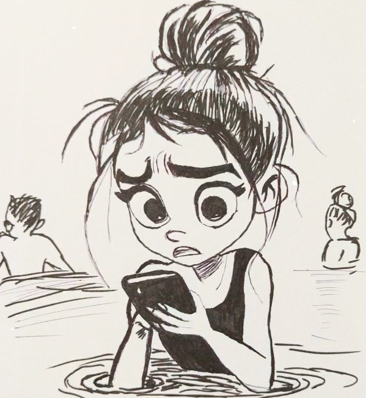
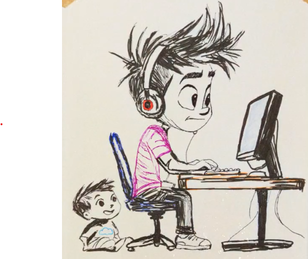
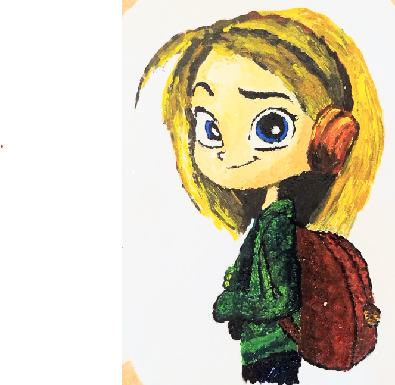
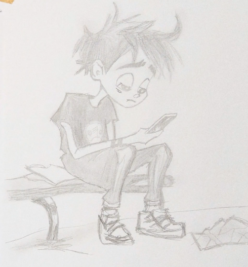
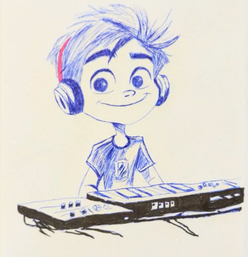
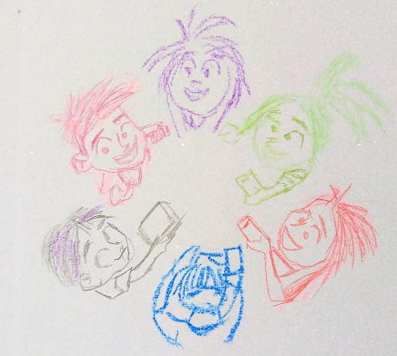

# Interaktive Version: "Verbunden: Mehr als nur ein Klick"

## Teil 1: Mias Geheimnis (WhatsApp-Gruppen und Gruppendruck)

Mia liebt es, jeden Dienstag und Donnerstag zum Schwimmtraining zu gehen. Besonders das Springen vom Drei-Meter-Brett gibt ihr ein Gefühl von Freiheit. "Heute schaffe ich einen perfekten Köpfer!", denkt sie, während sie die Leiter hochklettert.

Nachdem sie nach dem Sprung aus dem Becken gestiegen ist und sich abgetrocknet hat, vibriert ihr Handy in der Sporttasche. Eine neue Nachricht in der Klassen-WhatsApp-Gruppe. Schnell schaut sie nach.

"Habt ihr schon die Bilder von Jonas gesehen? Total peinlich! 😂"

Darunter ein Foto von Jonas aus der Parallelklasse in einer unvorteilhaften Situation. Mia zögert. Jonas ist eigentlich nett. Sollte sie etwas sagen?

"Wer das Bild nicht weiterleitet, fliegt aus der Gruppe!", schreibt Lisa, die Anführerin.

Mias Herz rast. Sie will nicht ausgeschlossen werden, aber es fühlt sich falsch an. Ihr Trainer kommt vorbei. "Guter Sprung vorhin, Mia! Alles okay?"

"Ja, alles gut." Sie steckt das Handy weg, aber die WhatsApp-Nachricht beschäftigt sie weiter.

Zuhause angekommen, sitzt Mia in ihrem Zimmer.
Sie schaut aus dem Fenster und sieht einen Vogel, der nach seinem kurzen Bad in einer Pfütze eifrig Insekten jagt. Zielsicher fängt er einen Käfer und fliegt davon. 
Mia grübelt.

**Was soll Mia tun?**
A) Das Bild weiterleiten, um nicht aus der Gruppe zu fliegen.
B) In der Gruppe schreiben, dass das Teilen des Bildes nicht in Ordnung ist.
C) Den Chat stumm schalten und ignorieren.

## Teil 2A: Tims virtuelle Welt (Nach Mias Entscheidung A)

Tim beobachtet aus seinem Fenster einen Vogel, der gerade Futter für seine Jungen sammelt. Sein Handy vibriert – eine Nachricht von Mia, die ein peinliches Bild von Jonas weitergeleitet hat. Tim kennt Jonas nicht gut, aber das Bild bringt ihn zum Lachen.

"Tim, spielst du mit mir?", fragt sein sechsjähriger Bruder Max und hält sein Lieblingsbuch hoch.

"Später", antwortet Tim. "Ich muss noch eine Runde 'Battle Zone' spielen." Battle Zone ist eigentlich erst ab 16 Jahren freigegeben, aber alle aus seiner Klasse spielen es.

Tim ist richtig gut im Spiel und wird oft von älteren Spielern für ihr Team rekrutiert. Heute schreibt ihm jemand namens "NightWolf" im Spiele-Chat: "Du bist echt krass! Wie alt bist du?"

Tim ist stolz: "13, aber ich spiele besser als die meisten 16-Jährigen!"

"Cool", antwortet NightWolf. "Hast du Insta oder WhatsApp? Wir könnten ein paar Profi-Spieler zusammentrommeln."

Tim zögert. Seine Eltern haben ihm eingeschärft, keine Kontaktdaten weiterzugeben. Dennoch fühlt er sich geschmeichelt. Als echter Gamer anerkannt zu werden, bedeutet ihm viel.

**Was soll Tim tun?**
A) Seine Kontaktdaten weitergeben, um mit den Profis zu spielen.
B) Höflich ablehnen und vorschlagen, weiter im Spiel-Chat zu kommunizieren.
C) Seinen Eltern von der Anfrage erzählen und sie um Rat fragen.

## Teil 2B: Tims virtuelle Welt (Nach Mias Entscheidung B)

Tim beobachtet aus seinem Fenster einen Vogel, der gerade Futter für seine Jungen sammelt. Sein Handy vibriert – eine Nachricht in der Klassen-WhatsApp-Gruppe. Mia aus der Parallelklasse hat geschrieben: "Ich finde, wir sollten das Bild von Jonas löschen. Wie würdet ihr euch fühlen?" Tim ist beeindruckt von ihrem Mut.

"Tim, spielst du mit mir?", fragt sein sechsjähriger Bruder Max und hält sein Lieblingsbuch hoch.

"Später", antwortet Tim. "Ich muss noch eine Runde 'Battle Zone' spielen." Battle Zone ist eigentlich erst ab 16 Jahren freigegeben, aber alle aus seiner Klasse spielen es.

Tim ist richtig gut im Spiel und wird oft von älteren Spielern für ihr Team rekrutiert. Heute schreibt ihm jemand namens "NightWolf" im Spiele-Chat: "Du bist echt krass! Wie alt bist du?"

Tim ist stolz: "13, aber ich spiele besser als die meisten 16-Jährigen!"

"Cool", antwortet NightWolf. "Hast du Insta oder WhatsApp? Wir könnten ein paar Profi-Spieler zusammentrommeln."

Tim zögert. Seine Eltern haben ihm eingeschärft, keine Kontaktdaten weiterzugeben. Dennoch fühlt er sich geschmeichelt. Als echter Gamer anerkannt zu werden, bedeutet ihm viel.

**Was soll Tim tun?**
A) Seine Kontaktdaten weitergeben, um mit den Profis zu spielen.
B) Höflich ablehnen und vorschlagen, weiter im Spiel-Chat zu kommunizieren.
C) Seinen Eltern von der Anfrage erzählen und sie um Rat fragen.

## Teil 2C: Tims virtuelle Welt (Nach Mias Entscheidung C)

Tim beobachtet aus seinem Fenster einen Vogel, der gerade Futter für seine Jungen sammelt. Sein Handy vibriert – eine Nachricht in der Klassen-WhatsApp-Gruppe über ein peinliches Bild von Jonas. Es scheint eine hitzige Diskussion zu geben, aber Tim bemerkt, dass manche, wie Mia aus der Parallelklasse, sich gar nicht daran beteiligen.

"Tim, spielst du mit mir?", fragt sein sechsjähriger Bruder Max und hält sein Lieblingsbuch hoch.

"Später", antwortet Tim. "Ich muss noch eine Runde 'Battle Zone' spielen." Battle Zone ist eigentlich erst ab 16 Jahren freigegeben, aber alle aus seiner Klasse spielen es.

Tim ist richtig gut im Spiel und wird oft von älteren Spielern für ihr Team rekrutiert. Heute schreibt ihm jemand namens "NightWolf" im Spiele-Chat: "Du bist echt krass! Wie alt bist du?"

Tim ist stolz: "13, aber ich spiele besser als die meisten 16-Jährigen!"

"Cool", antwortet NightWolf. "Hast du Insta oder WhatsApp? Wir könnten ein paar Profi-Spieler zusammentrommeln."

Tim zögert. Seine Eltern haben ihm eingeschärft, keine Kontaktdaten weiterzugeben. Dennoch fühlt er sich geschmeichelt. Als echter Gamer anerkannt zu werden, bedeutet ihm viel.

**Was soll Tim tun?**
A) Seine Kontaktdaten weitergeben, um mit den Profis zu spielen.
B) Höflich ablehnen und vorschlagen, weiter im Spiel-Chat zu kommunizieren.
C) Seinen Eltern von der Anfrage erzählen und sie um Rat fragen.

## Teil 3A: Emmas Entscheidung (Nach Tims Entscheidung A)

Emma hört ihre Lieblingsmusik, während sie zur Musikschule geht. Auf ihrem Handy erscheint eine Benachrichtigung von Tim, einem Jungen aus der Nachbarschaft, der gerade seinen Instagram-Account mit einem älteren Spieler namens NightWolf teilt, um "professionelle Gaming-Tipps" zu bekommen. Emma schüttelt den Kopf – das scheint ihr riskant.

Seit zwei Wochen chattet sie mit Liam, den sie in einem Fan-Forum zu ihrer Lieblingsserie kennengelernt hat. Er sagt, er sei 14 und verstehe sie wie niemand sonst.

"Du bist so reif für dein Alter", schreibt Liam. "Die anderen in deiner Klasse sind bestimmt alle kindisch."

Emma fühlt sich geschmeichelt. Niemand scheint sie so zu verstehen wie Liam. Doch heute hat er etwas Seltsames gefragt: "Kannst du mir ein Foto von dir schicken? Ein besonderes, nur für mich?"

Als sie durch das Wohnzimmerfenster von Tims Haus blickt, sieht sie Tim, der aufgeregt mit jemandem chattet. Seine Eltern sind nicht da und sein kleiner Bruder spielt allein.

**Was soll Emma tun?**
A) Liam das gewünschte Foto schicken, weil er ihr vertrauter Online-Freund ist.
B) Liam sagen, dass sie keine privaten Fotos verschickt und ihre Lehrerin um Rat fragen.
C) Den Kontakt zu Liam abbrechen ohne weitere Erklärung.

## Teil 3B: Emmas Entscheidung (Nach Tims Entscheidung B)

Emma hört ihre Lieblingsmusik, während sie zur Musikschule geht. Als sie an Tims Haus vorbeikommt, fällt ihr Blick durch das Wohnzimmerfenster. Tim sitzt dort mit seinem kleinen Bruder und liest ihm ein Buch vor. Sein Computer ist ausgeschaltet. Emma lächelt – es ist schön zu sehen, wie jemand Zeit mit seiner Familie verbringt statt nur am Bildschirm zu hängen.

Seit zwei Wochen chattet sie mit Liam, den sie in einem Fan-Forum zu ihrer Lieblingsserie kennengelernt hat. Er sagt, er sei 14 und verstehe sie wie niemand sonst.

"Du bist so reif für dein Alter", schreibt Liam. "Die anderen in deiner Klasse sind bestimmt alle kindisch."

Emma fühlt sich geschmeichelt. Niemand scheint sie so zu verstehen wie Liam. Doch heute hat er etwas Seltsames gefragt: "Kannst du mir ein Foto von dir schicken? Ein besonderes, nur für mich?"

In der Musikschule angekommen, denkt Emma an Tims Beispiel – wie er vorsichtig mit seinen Online-Kontakten umgegangen ist.

**Was soll Emma tun?**
A) Liam das gewünschte Foto schicken, weil er ihr vertrauter Online-Freund ist.
B) Liam sagen, dass sie keine privaten Fotos verschickt und ihre Lehrerin um Rat fragen.
C) Den Kontakt zu Liam abbrechen ohne weitere Erklärung.

## Teil 3C: Emmas Entscheidung (Nach Tims Entscheidung C)

Emma hört ihre Lieblingsmusik, während sie zur Musikschule geht. Sie sieht Tim mit seinen Eltern vor dem Haus stehen. Sie unterhalten sich ernst, und Tim zeigt ihnen etwas auf seinem Handy. Emma fragt sich, ob er Probleme hat.

Seit zwei Wochen chattet sie mit Liam, den sie in einem Fan-Forum zu ihrer Lieblingsserie kennengelernt hat. Er sagt, er sei 14 und verstehe sie wie niemand sonst.

"Du bist so reif für dein Alter", schreibt Liam. "Die anderen in deiner Klasse sind bestimmt alle kindisch."

Emma fühlt sich geschmeichelt. Niemand scheint sie so zu verstehen wie Liam. Doch heute hat er etwas Seltsames gefragt: "Kannst du mir ein Foto von dir schicken? Ein besonderes, nur für mich?"

Emma erinnert sich an den Vortrag über Online-Sicherheit in der Schule, in dem erklärt wurde, dass man bei Online-Freundschaften vorsichtig sein sollte, besonders wenn persönliche Informationen oder Fotos verlangt werden.

**Was soll Emma tun?**
A) Liam das gewünschte Foto schicken, weil er ihr vertrauter Online-Freund ist.
B) Liam sagen, dass sie keine privaten Fotos verschickt und ihre Lehrerin um Rat fragen.
C) Den Kontakt zu Liam abbrechen ohne weitere Erklärung.

## Teil 4A: Jonas' Comeback (Nach Emmas Entscheidung A)

Jonas sitzt allein auf einer Parkbank und starrt auf sein Handy. Ein peinliches Bild von ihm geht in den WhatsApp-Gruppen rum. Er ist am Boden zerstört, besonders weil er morgen beim Schulfest seinen selbstgeschriebenen Rap vortragen will.

Er bekommt eine Nachricht von Emma, einem Mädchen aus der Nachbarschaft. Sie schreibt ihm, dass sie gerade eine schwierige Situation mit einem Online-Freund hat. Sie hat ihm ein privates Foto geschickt und jetzt fordert er mehr und droht, das Foto weiterzuleiten, wenn sie nicht mitmacht. Jonas ist überrascht, dass sie sich ausgerechnet ihm anvertraut.

"Ich weiß, wie du dich fühlst", schreibt er zurück. "Mit mir machen sie gerade auch etwas Ähnliches."

Jonas' Handy klingelt. Es ist Alex, sein bester Freund: "Hey, hast du das Bild gesehen? Sollen wir was unternehmen?"

**Was soll Jonas tun?**
A) Sich bei Emma für das Vertrauen bedanken, aber sagen, dass er selbst zu viele Probleme hat.
B) Emma raten, mit einem Erwachsenen zu sprechen, und Alex bitten, ihm mit seinem eigenen Problem zu helfen.
C) Emma anbieten, gemeinsam zur Schulsozialarbeiterin zu gehen, und seinen Raptext über Online-Respekt fertigstellen.

## Teil 4B: Jonas' Comeback (Nach Emmas Entscheidung B)

Jonas sitzt allein auf einer Parkbank und starrt auf sein Handy. Ein peinliches Bild von ihm geht in den WhatsApp-Gruppen rum. Er ist am Boden zerstört, besonders weil er morgen beim Schulfest seinen selbstgeschriebenen Rap vortragen will.

Emma von der Musikschule kommt vorbei. "Hey Jonas, ich habe gerade gehört, was passiert ist. Das ist nicht fair."

Jonas schaut überrascht auf. "Du kennst mich?"

"Wir haben letztes Jahr beim Schulkonzert zusammen gespielt", erinnert sie ihn. "Außerdem...", sie zögert, "ich wollte dir sagen, dass ich gerade etwas Wichtiges gelernt habe. Manchmal sind Leute online nicht die, für die sie sich ausgeben."

Sie erzählt ihm von ihrem Online-Freund Liam und wie ihre Musiklehrerin ihr geholfen hat zu erkennen, dass er kein Teenager sein könnte. "Ich habe gerade gelernt, dass man vorsichtig sein muss, wem man vertraut."

Jonas' Handy klingelt. Es ist Alex, sein bester Freund: "Hey, hast du das Bild gesehen? Sollen wir was unternehmen?"

**Was soll Jonas tun?**
A) Emma und Alex ignorieren und seinen Rapauftritt absagen, weil er zu gestresst ist.
B) Mit Emma und Alex über das Cybermobbing sprechen und Unterstützung bei Lehrkräften suchen.
C) Einen kraftvollen Raptext über Cybermobbing und Online-Identität schreiben und Emma bitten, ihn mit der Geige zu begleiten.

## Teil 4C: Jonas' Comeback (Nach Emmas Entscheidung C)

Jonas sitzt allein auf einer Parkbank und starrt auf sein Handy. Ein peinliches Bild von ihm geht in den WhatsApp-Gruppen rum. Er ist am Boden zerstört, besonders weil er morgen beim Schulfest seinen selbstgeschriebenen Rap vortragen will.

Emma von der Musikschule kommt mit schnellen Schritten vorbei. Sie wirkt aufgewühlt und tippt hektisch auf ihrem Handy. Als sie Jonas sieht, hält sie inne.

"Alles okay bei dir?", fragt sie.

Jonas zuckt mit den Schultern. "Nicht wirklich. Jemand hat ein peinliches Foto von mir geteilt."

Emma setzt sich neben ihn. "Ich habe gerade einen Online-Kontakt geblockt, der mir komisch kam. Man weiß nie, wer wirklich hinter dem Bildschirm sitzt."

Jonas' Handy klingelt. Es ist Alex, sein bester Freund: "Hey, hast du das Bild gesehen? Sollen wir was unternehmen?"

**Was soll Jonas tun?**
A) Emma und Alex ignorieren und versuchen, das Problem selbst zu lösen.
B) Mit Emma und Alex über ihre Erfahrungen sprechen und gemeinsam überlegen, was zu tun ist.
C) Eine Kampagne gegen Cybermobbing starten und sein Rap-Talent nutzen, um darauf aufmerksam zu machen.

## Teil 5A: Nicks digitale Souveränität (Nach Jonas' Entscheidung A)

Nick war vor zwei Wochen neu in die Klasse gekommen und die anderen Kinder waren noch nicht ganz schlau aus ihm geworden. Er war nicht bei TikTok, hatte kein Snapchat und war auch nicht in der Klassen-WhatsApp-Gruppe.

Heute hört er, wie Jonas vom Mobbing betroffen ist und wie ein Mädchen namens Emma Probleme mit einem seltsamen Online-Kontakt hat. Beide scheinen sich aber nicht helfen zu lassen – Jonas ignoriert sogar seinen besten Freund und Emma steht jetzt allein vor der Musikschule.

In seinem Zimmer sitzt Nick vor seinem Computer und programmiert einen Drumbeat. Seine Schwester kommt herein. "Hey, warum hilfst du den anderen nicht? Du weißt doch so viel über Online-Sicherheit."

Nick schaut auf. "Ich bin neu hier. Niemand kennt mich, und niemand will meinen Rat hören."

**Was soll Nick tun?**
A) Sich aus den Problemen der anderen heraushalten und sich auf seine Musik konzentrieren.
B) Einen Blogpost über digitale Sicherheit schreiben und anonym in der Schule verteilen.
C) Direkt auf Jonas und Emma zugehen und ihnen seine Hilfe anbieten.

## Teil 5B: Nicks digitale Souveränität (Nach Jonas' Entscheidung B)

Nick war vor zwei Wochen neu in die Klasse gekommen und die anderen Kinder waren noch nicht ganz schlau aus ihm geworden. Er war nicht bei TikTok, hatte kein Snapchat und war auch nicht in der Klassen-WhatsApp-Gruppe.

In der Pause sieht er, wie Jonas und Emma mit der Schulsozialarbeiterin sprechen. Sie wirken ernst, aber auch erleichtert. Nick ist beeindruckt, wie sie sich gegenseitig unterstützen.

Seine Schwester kommt am Nachmittag in sein Zimmer, während er an seinem neuesten Beat arbeitet. "Hast du schon gehört? Jonas und Emma haben wegen Online-Problemen Hilfe geholt. Findest du das cool oder peinlich?"

Nick schaut nachdenklich auf. "Cool. Es braucht Mut, sich Hilfe zu holen."

**Was soll Nick tun?**
A) Weiter beobachten und abwarten, ob sich eine natürliche Gelegenheit ergibt, Jonas und Emma kennenzulernen.
B) Jonas eine Nachricht schicken und anbieten, Beats für seinen Rap beim Schulfest zu produzieren.
C) Einen Workshop über digitale Sicherheit und kreative Nutzung des Internets in der Schule vorschlagen.

## Teil 5C: Nicks digitale Souveränität (Nach Jonas' Entscheidung C)

Nick war vor zwei Wochen neu in die Klasse gekommen und die anderen Kinder waren noch nicht ganz schlau aus ihm geworden. Er war nicht bei TikTok, hatte kein Snapchat und war auch nicht in der Klassen-WhatsApp-Gruppe.

Heute hört er, dass Jonas eine Kampagne gegen Cybermobbing startet und einen Rap dafür vorbereitet. Nick ist beeindruckt von Jonas' Mut und Kreativität.

In seinem Zimmer sitzt Nick vor seinem Computer und arbeitet an einem neuen Beat. Seine Schwester kommt herein. "Hey, hast du von Jonas' Anti-Cybermobbing-Rap gehört? Er sucht noch jemanden für die Musik."

Nick schaut interessiert auf. "Wirklich? Das klingt nach etwas, wobei ich helfen könnte."

**Was soll Nick tun?**
A) Abwarten, ob Jonas selbst auf ihn zukommt, da er noch neu an der Schule ist.
B) Jonas direkt kontaktieren und seine Hilfe bei der Musikproduktion anbieten.
C) Seine eigene digitale Kunst und Musik einbringen und mit Jonas ein gemeinsames Multimedia-Projekt entwerfen.

## Verschiedene Enden basierend auf Nicks Entscheidungen:

### Ende 1 (Nach Nicks Entscheidung A - Rückzug):
Nick bleibt für sich und konzentriert sich auf seine eigenen Projekte. Bei der Schulveranstaltung sieht er, wie die anderen mit ihren Problemen kämpfen. Jonas' Rap-Auftritt ist mittelmäßig wegen fehlender technischer Unterstützung, und Emma spielt ihre Geige allein. Nick erkennt, dass er eine Chance verpasst hat, sich einzubringen und Freundschaften zu schließen. Er nimmt sich vor, beim nächsten Mal mutiger zu sein und seine Fähigkeiten zum Wohle der Gemeinschaft einzusetzen.

### Ende 2 (Nach Nicks Entscheidung B - Unterstützung anbieten):
Nick überwindet seine Schüchternheit und bietet Jonas seine Hilfe bei der Musikproduktion an. Zusammen erstellen sie einen beeindruckenden Beat für Jonas' Rap gegen Cybermobbing. Bei der Schulveranstaltung werden sie bejubelt. Nach dem Auftritt kommen Emma, Mia und Tim auf sie zu, begeistert von ihrer Zusammenarbeit. Sie gründen eine neue Gruppe, in der jeder seine Stärken einbringt: Jonas' Texte, Nicks Musik, Emmas Geigenspiel, Mias Mut und Tims technisches Wissen. Sie vereinbaren, sich regelmäßig zu treffen – mit begrenzter Handyzeit und echten Gesprächen.

### Ende 3 (Nach Nicks Entscheidung C - Gemeinschaftsprojekt):
Nick, Jonas und Emma planen ein Multimedia-Projekt, das Rap, digitale Musik und visuelle Kunst verbindet. Sie laden auch Mia und Tim ein, ihre Fähigkeiten beizusteuern. Bei der Schulveranstaltung präsentieren sie nicht nur einen Rap, sondern eine vollständige Performance mit Live-Musik, digitalem Hintergrund und einer starken Botschaft über digitale Souveränität. Ihr Projekt wird zum Gesprächsthema der Schule und sogar darüber hinaus. Die Schuldirektorin schlägt vor, es beim städtischen Jugendfestival zu präsentieren. Die fünf Freunde haben nicht nur gelernt, sicher online zu navigieren, sondern auch ihre kreativen Talente zu nutzen, um etwas Positives zu bewirken. Sie planen bereits ihr nächstes Projekt – eine App, die Jugendlichen hilft, ihre digitale Identität selbstbestimmt zu gestalten.