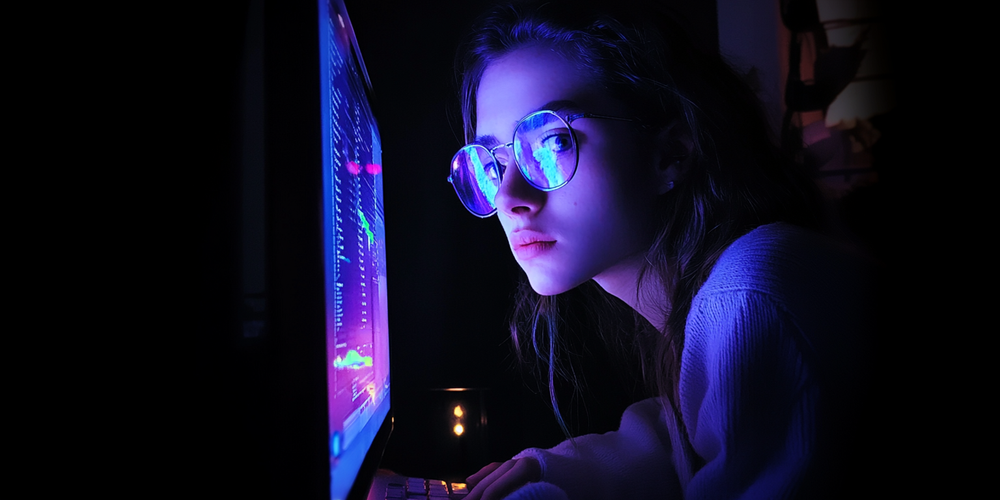
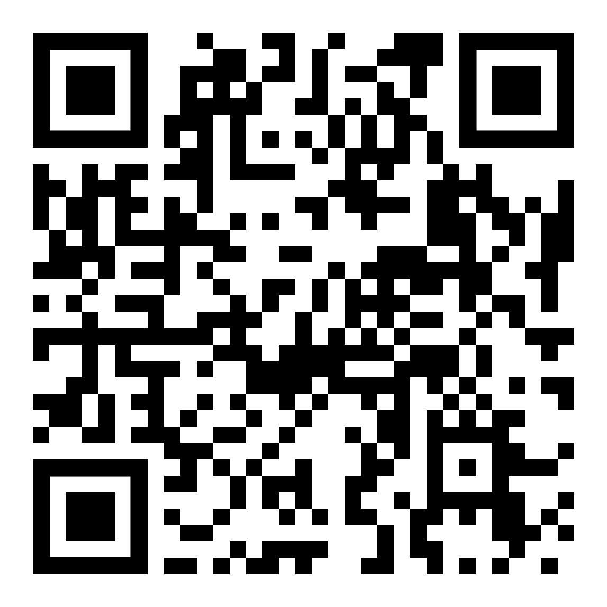
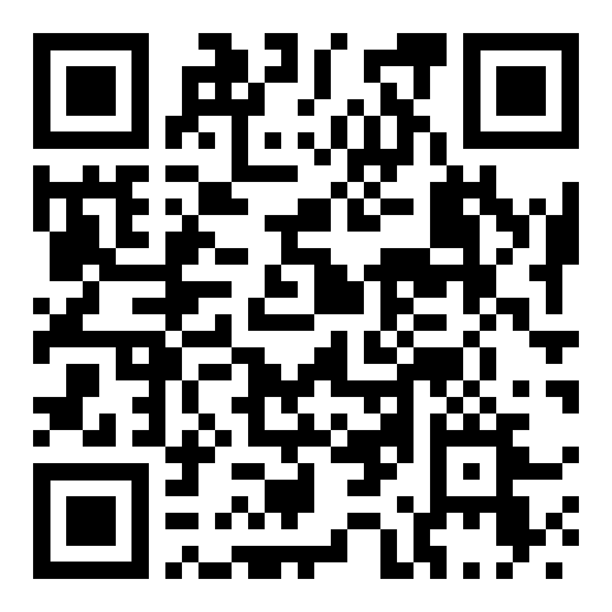

📡 Mein Leben, meine Apps
🔓 **Manifest der Digitalen Rebellion**
===
## Wir hacken Social Media – bevor es uns hackt

> 👾 Dies ist keine Anleitung für „braves Verhalten“.
> Dies ist ein Handbuch für Rebellion. Für Freiheit. Für dein Gehirn.
> Willkommen im Untergrund, Rekrut. Willkommen bei den White-ish Hat Kids.

> Quelle: Midjourney

---

## ☠️ SYSTEMKOMPROMITTIERUNG: DU WURDEST GEHACKT

Du dachtest, dein Handy ist dein Spielzeug?
Haha, falsch gedacht. *Du* bist das Spielzeug.

### 🎯 Die Angreifer: Silicon Valley Nerds mit Milliardenbudget

### 📱 Das Einfallstor: TikTok, Insta, YouTube Shorts...

### 🧠 Das Ziel: Dein Gehirn

Und das Krasseste? Du hast freiwillig die Tür aufgemacht. Jeden. Verdammten. Tag.

---

## 🔍 Angriffsanalyse: So wirst du weichgekocht

### 🧨 **Cue – Der digitale Türklopfer**

*Ping!* – dein Handy vibriert. Dein Gehirn denkt: „Was verpasse ich?!“
Du denkst, du entscheidest? Nope. Dein Hirnstamm springt schneller als ein Twitch-Streamer auf ’nen Raid.

### 🔁 **Routine – Der Autopilot der Sucht**

Face-Unlock. Homescreen. Insta auf. Gehirn im Leerlauf.
Du bist im Tunnel. Kein Plan mehr, warum du das Handy überhaupt in die Hand genommen hast.

### 🍭 **Reward – Der Zucker fürs Hirn**

Jeder Swipe ist wie ein kleiner Gewinn am Spielautomaten: Ein Like, ein lustiges Video, ein neuer Trend.
💣**Boom – Dopamin!** Dein Gehirn liebt das.

> Quelle: Midjourney
> 
Perfekte Körper, perfekte Zimmer, perfekte Leben – alles gefiltert, geschnitten und geschauspielert.

> Und du? Du siehst nur dein echtes Leben. Kein Wunder, dass du dich mies fühlst.

Das ist kein Zufall. Das ist der Trick.

**Dein Selbstwert?** Gehackt.
**Deine Aufmerksamkeit?** Geklaut
**Dein Hirn?** Abhängig.

---

## ⚔️ Gegenschlag: **Wir hacken deren ausgeklügeltes System!**

Hier ist deine Mission. Schritt für Schritt.
Operation „RECLAIM YOUR BRAIN“ startet… **JETZT.**

---

## 🔧 Hack the Cue – Zerstör den Trigger

🧱 **Icons in Käfige sperren**
Pack alle Social-Apps in ’nen Ordner.

> Warum? Damit du suchen musst. Diese „Friction“ bremst dein Zombie-Gehirn.
> Was passiert? Du denkst nach, bevor du tappst. Kontrollierst statt kontrolliert zu werden.

🔕 **Kill die Notifications**

> Alle Benachrichtigungen AUS. Ja, alle. Außer vielleicht Notrufe deiner Oma.
> Ohne Ping – kein Cue – keine Falle.

🕶️ **Monochrom aktivieren**

> Farben manipulieren dich. Rot heißt: „SCHNELL! REAGIER!“
> In Graustufen sehen deine Apps aus wie tote Icons. Keine Reaktion? Kein Kick.

---

## 💣 Hack the Routine – Bring den Ablauf zum Absturz

🗑️ **Apps löschen = Exploit patchen**

> TikTok, Insta, Reddit: Weg damit. Jetzt.
> Klingt hart, fühlt sich an wie ein Rage-Quit – ist aber ein echter Buff für dein Hirn.

🎒 **Phone unreachable machen**

> Handy in den Rucksack, nicht in die Hosentasche. (passe aber wegen Diebstahl auf)
> Zuhause? In die Küche mit dem Ding. Kein Griff = kein Griff ins digitale Klo.

📵 **Oldschool leben**

> Offline ist das neue Cool.
> Du bist kein NPC – verhalte dich nicht wie einer.

---

## 💥 Hack the Reward – Sabotier das Belohnungssystem

🎯 **Stell den Bildschirm auf *Bunker-Modus***

> Schwarzweiß + Nachtmodus = kein Hirn-Kick mehr.

👻 **Kill den Algorithmus**

> Kein Scrollen. Kein „nur mal kurz gucken“. Jeder Swipe ist ein Datenleck – schließ es. Weg mit den Zombie-Apps.

🏆 **Belohn dich real**

> Mach was Cooles im echten Leben. Lern was, bau was, zock was Offline – dann gibt’s Dopamin, das du dir selbst verdienst. Nicht vom Silicon Valley Tropf.

---

## 🔓 DEIN SYSTEM IST JETZT CLEAN

✔️ **Du bist wieder root**
Du hast wieder Kontrolle über deine Zeit.
Keine App bestimmt mehr, wann du was fühlst.

✔️ **Du surfst nicht – du tauchst tief**
Ohne 1000 Reize im Sekundentakt wird dein Kopf wieder klar.
Plötzlich hast du echte Ideen, nicht nur Reaktionen.

✔️ **Du bist nicht mehr Teil der Farm**
Du bist kein Daten-Schaf mehr. Du bist der Hirte.
Die anderen? Noch am grasen.

---

## 📜 Abschluss-Codex

Dies ist kein Aufruf zur völligen Abstinenz.
Dies ist ein Manifest für **digitale Selbstverteidigung**.
Für Menschen, die nicht manipuliert werden wollen.
Für Hacker im Herzen – mit sauberem System.

---

## 🎥 Pflichtlektüre

**Youtube:  Andrew Kirby - How Social Media Cahnges Your Brain**
**https://youtu.be/uVBNLznLdxc?feature=shared**

**Youtuebe:  Andrew Kirby - PHONE ADDICTION: 3 Strange Steps To Snap You Out**
**https://youtu.be/-dqmDq-qlGM?feature=shared**

